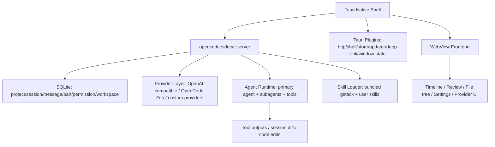
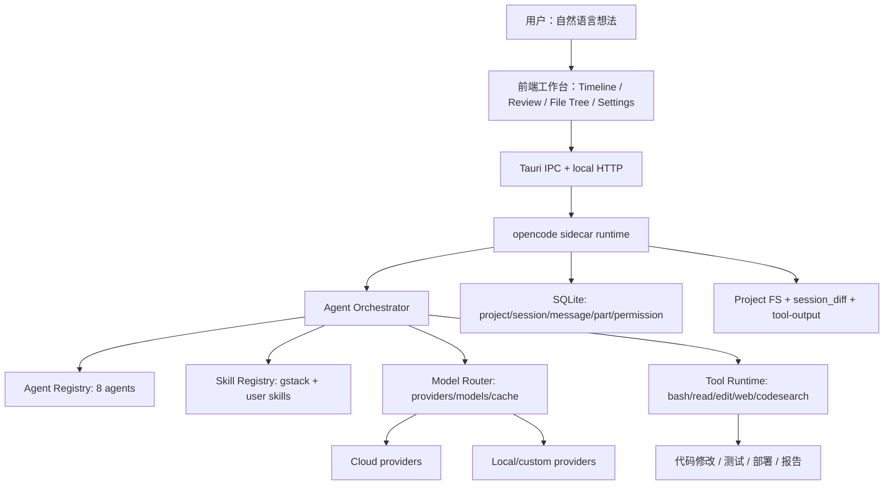

# Crow5深度分析与个人能力提升落地计划

更新时间：2026-05-25
分析对象：Crow5 Desktop v1.3.13、本机安装路径 `/Applications/Crow5.app`、Xike Lab 当前分支 `codex/paperclip-local-governance`

## 证据范围与可信度

**本报告不按宣传稿复述。**我实际检查了以下来源：

- Crow5 本机安装包：`/Applications/Crow5.app/Contents/Info.plist` 显示 `CFBundleIdentifier=com.crow5.desktop`、`CFBundleShortVersionString=1.3.13`、URL schemes 为 `crow5` 和 `opencode`。
- Crow5 bundle 结构：`Contents/MacOS/Crow5`、`Contents/MacOS/opencode-cli`、`Contents/Resources/resources/default-opencode.jsonc`、`Contents/Resources/resources/skills/gstack/**`。
- Crow5 用户数据：`~/Library/Application Support/com.crow5.desktop/opencode/opencode.db`、`models.json`、`opencode.jsonc`、`opencode.global.dat`、`session_diff/**`、`tool-output/**`。
- Crow5 运行日志：`~/Library/Logs/com.crow5.desktop/opencode-desktop_2026-05-24_12-46-24.log`。
- Crow5 UI 观察：启动页、主工作台、设置页、提供商页、技能页、多 Agent 会话区、审查/文件树区、模型/Skills/权限控件。
- Crow5 官网与更新日志：官方页面 [crow5.com](https://www.crow5.com/) 于 2026-05-25 验证，包含 v1.3.13 更新说明。
- Xike Lab 当前代码：`server.js`、`src/**`、`public/app.js`、`docs/local-governance-learning-record.md`、测试结果。

需要明确的限制：

- Crow5 安装包没有暴露完整源码树或 Electron `app.asar`。可见结构是 **Tauri 原生壳 + WebView 前端资源 + opencode sidecar + 配置/SQLite/Skills**。算法级细节只能从配置、日志、CLI、数据库、UI 与二进制字符串进行证据化推断。
- 官网宣称 “500+ Skills / 200+ models”；本机 UI 实测显示 **8 个 Agent / 22 个绑定 Skill / 305 个已安装 Skill**，本机 `models.json` 实测 **134 个 provider / 4846 个 model 条目**。两者不是冲突：官网讲生态规模，本机讲当前安装/缓存状态。

## 一、Crow5产品核心价值与设计理念

### 1.1 核心价值主张：从“想法”到“可运行软件”

Crow5 的主张是 **“做软件有想法就够了”**。它不是单纯给一个聊天框，而是把软件开发拆成一个可见流水线：

1. **自然语言入口**：用户只描述目标，例如官网示例里“一句话生成一个完整系统”。
2. **Plan**：主 Agent 理解意图、拆解目标、决定是否需要子 Agent。
3. **Build**：实现 Agent 生成代码或执行工具。
4. **QA**：测试 Agent 做验收、浏览器验证、问题归因。
5. **Ship**：部署、合并、PR、发版、文档同步。
6. **可视化审查**：主界面右侧显示审查区、文件变更区，避免用户完全信任黑箱输出。

这个路径对普通用户的价值是：**把工程流程包装成角色协作，而不是要求用户先学 Git、终端、测试、CI、部署、模型配置。**

对 Xike Lab 的启发：现在 Xike Lab 有很多强能力，但产品入口仍像“AI 控制台”。Crow5 更像“把想法推进为交付物的指挥台”。Xike Lab 下一步应该把治理、委派、预算、审批包装成一个明确的 **Idea -> Plan -> Work -> Verify -> Archive** 流程。

### 1.2 创作、知识、办公、开发四大模块

官网把 Crow5 定位成统一入口：**创作、知识、办公、开发**。本机 v1.3.13 当前 UI 更偏开发工作台，但四类模块可以按产品边界拆解如下。

| 模块 | 目标用户动作 | 功能边界 | 数据流转 | 本机观察 |
| --- | --- | --- | --- | --- |
| 创作 | 画图、写作、PPT、海报、视频、音乐 | 生成内容资产，偏多模态生产 | Prompt -> 模型/Skill -> 文件或外部素材 | 当前 UI 未看到独立创作页，更多是官网定位 |
| 知识 | 知识库、问答、总结、翻译、论文 | 读取资料、形成可复用上下文 | 文件/会话 -> 索引/摘要 -> 问答 | 本机 DB 有 session/message/part，官网强调全工程理解 |
| 办公 | 笔记、文档、表格、会议、AI 秘书 | 日常文档与流程自动化 | 用户资料 -> Agent/Skill -> 文档/任务 | 当前左侧有“数据库”“Memory Bank”“超级工作站”等待开放入口 |
| 开发 | 做方案、做产品、Code、部署上线 | 软件交付主路径 | 项目目录 -> Agent/Skill/模型 -> 代码 diff/测试/部署 | 本机开发工作台最完整：审查、文件树、终端、模型、Skills、权限 |

结论：Crow5 的四大模块不是四个完全隔离产品，而是 **同一 Agent/Skill/模型底座在不同用户任务上的包装**。Xike Lab 不应照抄四个大菜单，而应先把“开发”这条主路径做深，再用同一个底座扩展到“知识/办公/创作”。

### 1.3 用户体验设计

**统一入口设计。**本机主界面左侧是项目/会话入口，中间是对话时间线，右侧是审查与文件变化区，底部输入区同时提供模式、模型、Skills、权限控制。用户不需要先理解后端 API，只要从输入框开始。

**多 Agent 协同可视化。**本机 UI 里能看到 Reinhard、Emilia、Rem、Chunli 等智能体块；设置页技能面板显示当前会话绑定关系：主 Agent 是 `reinhard`，默认子 Agent 是 `rem, emilia`，按需 Agent 是 `mario, chunli, ayanami, zhaoyun, sora`。这让“谁在干什么”可见。

**自然语言 + GUI。**自然语言负责表达目标；GUI 负责降低风险：模型选择、Skills 选择、自动接受权限、文件变化、审查、Git 仓库提示、设置页 provider/skill 状态。这是 Crow5 比纯 CLI 更容易被非工程用户接受的关键。

**错误处理。**日志中能看到 provider 诊断、usage limit、DeepSeek reasoning_content 错误、duplicate skill warning；UI 有“问题 失败”“错误通知开关”“权限通知开关”“自动接受权限”。它没有隐藏错误，而是把错误变成会话事件和通知。

**用户引导。**启动时有数据库迁移进度；项目区有“创建 Git 仓库”提示；技能页显示 Agent/Skill 绑定统计；提供商页显示激活状态、已连接提供商和热门 provider 连接入口。

### 1.4 v1.3.13 迭代策略

官方 v1.3.13 更新日志显示优先级集中在：

- **性能**：KV Cache 命中率提升约 30%，主界面渲染优化，减少卡顿与闪屏。
- **协同体验**：审核功能升级，主 Agent 简单任务可直接处理，不再总是调度子 Agent。
- **模型管理**：自定义模型新增、修改、删除。
- **用量透明**：新增用量及额度展示。
- **体验细节**：侧边栏、布局、文件变更提示。
- **反馈闭环**：集中修复 56 项内测问题。

这说明 Crow5 的迭代不是先堆新概念，而是优先修 **成本、性能、模型配置、多 Agent 体验、可见性**。Xike Lab 当前已经做了预算治理和审批，这是对的；下一步要补的是“用量/成本和 Agent 工作状态在 UI 上一眼可见”。

## 二、Crow5全维度技术架构分析

### 2.1 多Agent协同系统（核心）

#### 2.1.1 8 个内置 Agent 与职责

本机 `default-opencode.jsonc` 和 UI 共同证明 Crow5 用配置驱动 Agent 协作：

| Agent | 类型 | 证据化职责 | Skill 绑定 |
| --- | --- | --- | --- |
| `reinhard` | 主 Agent | 统筹、计划、决定是否调度子 Agent；简单任务可直接处理 | 无固定 skill |
| `rem` | 默认子 Agent | 实现与修复、代码方案、二次判断 | `codex`, `review` |
| `emilia` | 默认子 Agent | QA、测试验收、浏览器验证、产品/市场判断 | `qa`, `qa-only`, `browse`, `office-hours` |
| `mario` | 按需 Agent | 交付、PR、发版 | `codex`, `ship` |
| `chunli` | 按需 Agent | 架构/产品范围/复盘/自动评审流程 | `plan-eng-review`, `plan-ceo-review`, `retro`, `autoplan` |
| `ayanami` | 按需 Agent | 根因排查、性能基准 | `investigate`, `benchmark` |
| `zhaoyun` | 按需 Agent | 部署、生产验证、安全、供应链 | `setup-deploy`, `land-and-deploy`, `canary`, `ship`, `careful`, `cso` |
| `sora` | 按需 Agent | 设计、文档、表达 | `design-consultation`, `design-review`, `plan-design-review`, `document-release` |

重点不是名字，而是 **角色、标签、技能、权限四件事被配置化**。Xike Lab 目前已有 room mode 和 role card，但还没有形成这种统一 registry。

#### 2.1.2 主 Agent 拆解与子 Agent 调度

本机配置里的 `dispatchRules` 按 tag 分派：

- `requirement/test/validation/browser/report` -> `emilia`
- `implement/feature/code/review/quality` -> `rem`
- `architecture/system-design/strategy/planning/retro` -> `chunli`
- `bug/debug/root-cause/performance` -> `ayanami`
- `deploy/release/canary/security/destructive` -> `zhaoyun`
- `ui/ux/design/docs/changelog` -> `sora`

从日志看，Crow5 的请求诊断会记录 `agent=emilia`、`agent=rem`、`agent=reinhard`、`step`、`maxSteps`、`tools`、`systemChars`、`cacheReadTokens`。这意味着它不是简单在一个 prompt 里假装多角色，而是为不同 Agent 发起可追踪的模型请求。

可推断流程：

```text
User prompt
  -> Reinhard 识别任务意图
  -> tag classifier / dispatchRules
  -> 创建子会话或子任务
  -> 每个子 Agent 使用绑定 skills 与工具权限
  -> 子 Agent 输出中间结论
  -> Reinhard 汇总成统一答案/下一步
```

#### 2.1.3 上下文管理和结论汇总

SQLite schema 证明 Crow5 将会话拆为：

- `session`：项目、目录、标题、版本、summary、permission、workspace。
- `message`：按 session 保存消息。
- `part`：消息片段，支持 text、reasoning、tool-call、tool-result 等。
- `session_diff/**`：保存会话对应的文件 diff。
- `tool-output/**`：保存工具输出，避免所有工具结果塞回主上下文。

日志里出现 `sourceMessages`、`contextMessages`、`modelMessages`、`prunedToolResults`、`protectedToolTokens`，说明它做了上下文裁剪与工具结果保护。v1.3.13 的 KV Cache 优化也反映其重点是降低长上下文成本。

#### 2.1.4 子 Agent 技能调用与并行执行

本机技能页显示 **8 Agent / 22 绑定 Skill / 305 已安装 Skill**。日志中不同子 Agent 在相近时间发起请求，说明至少支持多子任务并发或准并发推进。

技能调用不是魔法，核心是：

```json
{
  "agentSkillBindings": {
    "emilia": ["qa", "qa-only", "browse", "office-hours"],
    "rem": ["codex", "review"],
    "zhaoyun": ["setup-deploy", "land-and-deploy", "canary", "ship", "careful", "cso"]
  }
}
```

Xike Lab 落地时应先做这个结构，不要先做复杂 UI。

### 2.2 全工程代码库理解技术

#### 2.2.1 已观察到的能力

官网宣称 Crow5 有全工程级语义索引、跨文件跨模块分析、上下文精准预测补全、自然语言代码问答。本机可验证的支撑点是：

- UI 有“所有文件”“审查”“会话变更”“文件变化提示”。
- 日志工具列表出现 `codesearch`、`grep`、`glob`、`read`、`edit`、`write`。
- OpenCode 官网说明其具备 LSP 加载、多会话、任意模型、桌面端。
- SQLite 记录 session/message/part/diff，能为后续代码问答提供历史上下文。

没有直接证据证明本机暴露了独立 AST 索引表或向量索引表；这些可能在二进制内部、OpenCode sidecar 内存、外部缓存或未在当前样本触发。

#### 2.2.2 合理实现路径

一个与观察结果一致的工程级理解架构应是：

```text
Project root
  -> 文件扫描：respect .gitignore / 目录过滤 / 文件大小限制
  -> 语法层：LSP + Tree-sitter/语言 parser 提取 symbol/import/call
  -> 文本层：chunk + embedding 或 BM25/codesearch
  -> 图层：文件依赖、symbol 引用、修改影响面
  -> 会话层：把相关片段注入 Agent prompt
  -> 审查层：把 diff 与测试结果回写到 session_diff
```

Xike Lab 当前只有轻量 `VectorIndex`：默认 128 维 hash embedding，可选 Ollama；还没有 AST、symbol graph、依赖图、增量索引、代码问答引用链。因此不能声称已经具备 Crow5 级“全工程理解”。

#### 2.2.3 自然语言代码问答

Crow5 的产品路径是用户问“这个 API 在哪定义”，系统自动定位文件与片段。落地技术不是单一向量库，而是 **检索组合**：

- `rg`/文件名检索找到候选。
- LSP/Tree-sitter 找 definition/reference。
- embedding/BM25 找语义相近片段。
- 最近 diff/session 历史提高权重。
- 回答时附文件路径、行号、引用原因。

Xike Lab 应优先实现“可解释检索”，而不是先追求复杂 RAG。

### 2.3 技能市场与模型生态

#### 2.3.1 Skill 定义与安装机制

Crow5 bundle 内置 gstack skills，格式为 `SKILL.md` + YAML frontmatter + Markdown 指南。例如：

```yaml
---
name: qa
description: |
  Systematically QA test a web application and fix bugs found.
---
```

这与 OpenCode/Claude/Codex 的技能形态相近。关键设计点是：

- **描述字段决定何时调用**。
- **Skill 是可读文档，不是黑箱插件**。
- **脚本、assets、references 可作为附属资源**。
- **Agent 通过绑定关系拿到一部分 Skill，而不是全量乱用**。
- **权限系统能限制 skill/tool/read/write/task/question 等能力**。

Xike Lab 的 `SkillStore` 已经支持 `~/.claude-panel/skills/<name>/SKILL.md`、frontmatter、body 注入、数量/大小限制。这是基础，但比 Crow5 少：

- 没有 skill market 级分类与安装来源。
- 没有 Agent-Skill 绑定 UI。
- 没有 skill 权限策略。
- 没有 duplicate 检测、rank、冲突处理。
- 没有 usage analytics 和有效性诊断。

#### 2.3.2 模型生态

本机 `models.json` 实测包含 **134 provider / 4846 model 条目**，远超官网“200+ model”的宣传口径。UI 提供：

- 已连接：MiniMax Token Plan、OpenAI 自定义。
- 热门 provider：Anthropic、GitHub Copilot、Google、OpenRouter、Vercel AI Gateway、自定义 provider。
- 模型下拉：能在会话底部选择模型。

配置层使用 OpenAI-compatible provider：

```json
{
  "provider": {
    "crow5_china": {
      "npm": "@ai-sdk/openai-compatible",
      "options": {
        "baseURL": "https://api.crow5.com",
        "setCacheKey": true,
        "cache": "system"
      }
    }
  }
}
```

设计要点：

- provider 抽象优先于 model 抽象。
- 模型列表可以缓存。
- 用户最近使用模型、显示/隐藏模型、变体强度需要本地状态。
- free/public 模型、token plan、custom model manager 是商业化关键。

Xike Lab 当前有 `RoomAdaptersConfig`、Claude/Codex/Gemini/MiniMax/Ollama/OpenAI-compatible adapters，也有 `/v1/models` 兼容接口。差距在于：模型生态还停留在“开发者配置 adapter”，没有做到 Crow5 那种 **普通用户 provider 连接 + 模型市场 + 用量透明 + 自动匹配**。

任务类型到模型的自动匹配，可以先不做复杂算法，先做规则：

```js
export function chooseModelForTask({ tags, availableModels, recentModels }) {
  if (tags.includes('ui') || tags.includes('design')) return pick(availableModels, ['gpt', 'claude']);
  if (tags.includes('bug') || tags.includes('code')) return pick(availableModels, ['codex', 'claude', 'deepseek']);
  if (tags.includes('qa') || tags.includes('browser')) return pick(availableModels, ['fast', 'mini', 'free']);
  if (tags.includes('local') || tags.includes('privacy')) return pick(availableModels, ['ollama', 'local']);
  return recentModels[0] || availableModels[0];
}
```

本机 UI 没看到单独的 Ollama 入口，但 OpenCode/Crow5 的 provider 模式和自定义 provider 入口可以承接本地模型。Xike Lab 现有 Ollama adapter 应保留，并在 Model Center 里把它包装成普通用户可理解的“本机模型”。

### 2.4 桌面端应用架构

Crow5 v1.3.13 是 **Tauri 架构**，不是 Electron。证据：

- app 可执行文件为 Mach-O universal binary。
- WebView URL 为 `tauri://localhost/...`。
- 二进制字符串包含 `tauri-plugin-http`、`tauri-plugin-updater`、`tauri-plugin-shell`、`tauri-plugin-store`、`tauri-plugin-dialog`、`tauri-plugin-deep-link`、`tauri-plugin-window-state`。
- 启动日志显示 native app 初始化后启动 sidecar：`Spawning sidecar on http://127.0.0.1:<port>`。
- CLI 是 `opencode-cli`，提供 `serve`、`web`、`models`、`agent`、`db`、`debug` 等命令。

实际分层如下：



Xike Lab 目前是 **Node/Express + Web UI + Electron packaging**。这不是错，但 Crow5 的 Tauri + sidecar 结构带来几个优势：

- 原生壳更轻，启动更像桌面应用。
- sidecar 可独立演进，CLI/desktop 复用。
- SQLite 是事实上的系统记录。
- updater、deep link、window state、shell/http 权限由 Tauri 插件边界承接。

### 2.5 架构层综合：分层、数据流、扩展性与安全

#### 2.5.1 整体系统分层



#### 2.5.2 从自然语言到可运行软件的数据流

```text
1. 用户输入想法
2. 主 Agent 读取项目、模型、Skill、权限状态
3. 主 Agent 生成计划并打 tags
4. dispatchRules 选择子 Agent
5. 子 Agent 各自拿到绑定 Skill 和工具权限
6. 子 Agent 执行代码搜索、读取、编辑、测试、浏览器验证
7. 工具输出写入 tool-output，diff 写入 session_diff
8. session/message/part 记录所有对话与工具片段
9. 主 Agent 汇总结果，输出结论、分工、下一步
10. UI 展示文件变化、审查状态、错误、用量和权限请求
```

这个流程里，Crow5 的关键不是“模型更聪明”，而是 **所有中间状态都被产品化**：Agent、Skill、模型、文件变化、权限、错误、用量都能在 UI 或日志中被追踪。

#### 2.5.3 扩展性设计

Crow5 的扩展性来自四个 registry：

- **Agent registry**：新增 Agent 本质是新增角色、说明、权限、默认模型和绑定 Skill。
- **Skill registry**：新增 Skill 本质是新增 `SKILL.md` 和可选脚本/引用材料。
- **Provider registry**：新增模型供应商本质是新增 base URL、auth、models、兼容协议。
- **Tool/permission registry**：新增工具必须先定义权限边界，再暴露给 Agent。

Xike Lab 现在也有 store 和 route，但 registry 没有统一成产品概念。下一步应把 registry 作为一等架构，而不是继续按功能堆文件。

#### 2.5.4 安全性与 guard 设计

本机证据显示 Crow5 有权限与 guard 的多个层面：

- UI 层：`自动接受权限` 默认关闭，设置页有权限通知。
- DB 层：SQLite 有 `permission` 表，session 也有 `permission` 字段。
- CLI/Agent 层：`opencode-cli agent list` 输出里能看到 `read`、`skill`、`task`、`question`、`external_directory` 等权限动作，包含 allow/ask/deny。
- Skill 层：gstack skills 内部反复强调执行前检查、测试、证据、停止条件。
- 日志层：模型请求、错误、provider、token、tool schema 都会记录诊断。

对 Xike Lab 的落地要求：审批队列不能只管 shell 命令，还要管 **外部目录读写、密钥读取、Skill 调用、Plugin 执行、网络上传、模型密钥配置、自动接受权限作用域**。

## 三、个人与项目差距分析

这里的“你不会什么”不是评价个人能力，而是基于 Xike Lab 当前代码尚未证明的能力清单。

### 3.1 技术能力差距清单（按优先级排序）

| 优先级 | 你当前还没有证明会什么 | 证据 | 为什么重要 |
| --- | --- | --- | --- |
| P0 | **配置驱动的多 Agent 调度系统** | Xike Lab 有 `TaskGraph` 和 room dispatcher，但没有统一 `AgentRegistry + dispatchRules + AgentSkillBindings` | Crow5 的心脏就是角色/技能/权限/模型解耦 |
| P0 | **Agent 子任务会话化与结论汇总** | Xike Lab 有委派和房间，但子 Agent 不是 Crow5 这种 session/message/part 级可追踪结构 | 不可追踪就无法审计、复盘、重试 |
| P0 | **真实代码库索引：AST + symbol graph + text search 融合** | Xike Lab 仅有 hash/Ollama embedding，未见 Tree-sitter/LSP symbol 索引 | 全工程问答不能只靠向量 |
| P0 | **桌面权限模型与危险操作 guard** | Xike Lab 有 owner-token、approval gate，但插件/skills/model/tool 权限没有统一策略 | 多 Agent 能写文件和跑命令时必须先有权限系统 |
| P1 | **Tauri/Rust sidecar 桌面架构** | Xike Lab 仍以 Node/Electron 打包为主 | 不是必须迁移，但要理解 Crow5 的轻桌面边界 |
| P1 | **模型市场级 provider 管理** | Xike Lab 有 adapter 配置，但没有 provider onboarding、模型缓存、用量额度 UI | 普通用户不会手写 adapter JSON |
| P1 | **Skill 市场与冲突治理** | Xike Lab `SkillStore` 基础可用，但缺分类、绑定、权限、duplicate/rank | 技能多了以后，治理比加载更重要 |
| P1 | **前端工作台级复杂状态设计** | `public/app.js` 很大，UI 状态较集中 | Crow5 把会话、审查、文件、设置、provider 融在一个工作台 |
| P2 | **性能与成本诊断体系** | Xike Lab 有 budget/metrics，但缺 KV cache 命中、prompt/token/schema 诊断 UI | 成本不可见时，多 Agent 很快失控 |

### 3.2 架构设计差距

Xike Lab 的优势：

- 已经有治理能力：预算、审批、审计、委派、Autopilot 自启动。
- 已有多房间/多模式：chat/debate/squad/arena。
- 已有多 adapter：Claude/Codex/Gemini/MiniMax/Ollama/OpenAI-compatible。
- 测试基线不错：当前 `npm test` 228 个测试通过，e2e 47/47 通过。

Xike Lab 的不足：

- **系统分层还不够硬**：`server.js` 仍承担大量启动、路由、adapter、autopilot、OpenAI-compatible API 工作。
- **Agent 和 Skill 没有成为一等实体**：Crow5 的 Agent-Skill 绑定是产品功能；Xike Lab 目前更像运行时配置。
- **项目/会话/消息/工具输出的系统记录不统一**：Crow5 用 SQLite schema 明确记录 session/message/part；Xike Lab 的 room/session/metrics/audit 分散在多个 store。
- **扩展性仍偏“加 route + 加 store”**：缺少插件、模型、Agent、Skill 共用的 registry/policy/event schema。

### 3.3 产品思维差距

你现在的产品思维更偏“把能力做出来”，Crow5 更偏“让用户相信自己能从想法走到软件”。

具体差距：

- **你还不会把复杂能力压成一句主路径**：Xike Lab 有治理、房间、插件、MCP、Autopilot，但用户第一眼不知道应该从哪里开始。
- **你还不会把多 Agent 结果做成可视化项目管理体验**：Crow5 的 Agent 头像、状态、审查、文件变化，让用户知道 AI 正在做什么；Xike Lab 需要更统一的 Governance/Delegation/Agent Center。
- **你还不会把错误变成产品引导**：Crow5 把 provider、用量、权限、Git 缺失、文件变更都放进 UI；Xike Lab 的很多错误还偏日志/API。
- **你还没有明确商业化路径的入口**：Crow5 的 provider、用量额度、模型管理直接服务付费与留存；Xike Lab 的 license/payment 已有，但和核心工作流连接还弱。

### 3.4 工程实践差距

你已经有测试意识，但还缺四类实践：

- **证据化 UI 验收**：需要每次核心 UI 改动都保存截图/录屏/AX tree，而不是只跑 e2e。
- **性能预算**：需要记录主界面渲染耗时、WebSocket 消息量、token/schema 注入量、模型缓存命中。
- **权限审计**：需要每次 tool/skill/plugin/model 执行都留下 `who/what/why/approval/result/cost`。
- **迁移治理**：Crow5 启动时有数据库迁移流程和日志；Xike Lab 的 SQLite/文件 store 需要明确 migration/versioning。

## 四、12周分阶段学习计划

学习资源优先级：

- [Tauri v2 官方文档](https://v2.tauri.app/)：桌面壳、插件、updater、IPC。
- [OpenCode 官方文档](https://opencode.ai/docs/)：Agent、Skills、providers、session/db/debug。
- [OpenCode Skills 文档](https://open-code.ai/docs/en/skills)：Skill 发现、frontmatter、权限、按 Agent 覆盖。
- [Vercel AI Gateway SDKs & APIs](https://vercel.com/docs/ai-gateway/sdks-and-apis)：统一 provider、streaming、tool calling、200+ model gateway 思路。
- [Tree-sitter 官方文档](https://tree-sitter.github.io/)：增量解析、AST query。
- [SQLite 官方文档](https://www.sqlite.org/docs.html)：schema、migration、WAL、索引。

阶段实践项目：

- **入门期实践项目：Crow5 Evidence Replay Board**。目标是做一个只读页面，展示 Crow5 的版本、Agent、Skill、provider、SQLite schema 和日志摘要。不要接模型，只训练取证和产品拆解。
- **深入期实践项目：Agent Dispatcher + Codebase Index POC**。目标是输入一句任务，自动选择 Agent，并能回答 Xike Lab 代码路径问题。
- **实践期实践项目：Xike Lab Idea-to-Archive Flow**。目标是用户输入一句想法，系统生成计划、派发 Agent、记录审计、跑测试、归档报告。

### 4.1 入门期（第1-4周）：掌握Crow5核心使用与基础技术

#### 第1周：Crow5 产品与数据取证

优先级：P0
目标：把 Crow5 的 UI、文件、日志、DB 变成可复盘证据。

每日任务：

- Day 1：列出 Crow5 bundle、Application Support、Logs、Preferences，写 `docs/crow5-evidence-map.md`。
- Day 2：用 UI 逐页截图：主界面、设置、技能、提供商、审查、文件树。
- Day 3：导出 SQLite schema，画出 session/message/part/permission 数据图。
- Day 4：读 `default-opencode.jsonc`，整理 8 Agent、22 skill 绑定、dispatch rules。
- Day 5：读 gstack skills 前 10 个，提炼 skill 模板。
- Day 6：复盘 v1.3.13 更新日志，拆成性能/模型/协同/体验四类。
- Day 7：写一页总结：Crow5 如何让“想法”进入 Plan/Build/QA/Ship。

验收标准：有一份证据地图，包含路径、截图、配置摘录、DB schema、关键结论。

#### 第2周：OpenCode / Skill 基础

优先级：P0
目标：理解 Crow5 依托的 OpenCode 风格运行时。

每日任务：

- Day 1：跑 `opencode-cli --help`、`agent --help`、`db --help`、`debug --help`，整理命令表。
- Day 2：创建一个最小 `SKILL.md`，验证 frontmatter、description、body。
- Day 3：研究 skill discovery：项目级、全局级、Claude-compatible、agent-compatible。
- Day 4：写一个 Xike Lab skill loader 对照表。
- Day 5：写 skill 权限策略草案：allow/ask/deny。
- Day 6：给 Xike Lab 设计 `AgentSkillBinding` JSON。
- Day 7：用测试验证：禁用 skill 不会注入 prompt。

验收标准：Xike Lab 有一个 `docs/agent-skill-registry-design.md`。

#### 第3周：Tauri 与桌面 sidecar

优先级：P1
目标：理解 Crow5 为什么用 Tauri + sidecar。

每日任务：

- Day 1：读 Tauri v2 architecture/plugin/updater 文档。
- Day 2：做一个最小 Tauri app，按钮调用 Rust command。
- Day 3：Tauri 启动本地 sidecar HTTP server。
- Day 4：WebView 调 sidecar API，显示健康状态。
- Day 5：加入 window-state 和 deep-link。
- Day 6：写 Xike Lab 是否迁移 Tauri 的取舍文档。
- Day 7：Demo 演示：Tauri shell + Node sidecar 启动/关闭。

验收标准：一个 1 页 demo，说明 Electron 保留还是 Tauri 试验，不急于迁移主项目。

#### 第4周：模型 provider 与用量透明

优先级：P0
目标：把模型配置从“开发者配置”变成“用户可管理”。

每日任务：

- Day 1：整理 Xike Lab 当前 adapters。
- Day 2：设计 provider schema：id/name/baseUrl/authType/models/visibility。
- Day 3：实现模型列表缓存结构草案。
- Day 4：加 provider health check API。
- Day 5：加模型最近使用记录。
- Day 6：设计用量/额度 UI。
- Day 7：验收：能显示 provider、model、状态、最近使用、错误。

验收标准：Xike Lab 有 provider registry 原型和测试。

### 4.2 深入期（第5-8周）：拆解核心模块实现原理

#### 第5周：多 Agent 调度核心

优先级：P0
每日任务：

- Day 1：定义 `AgentRegistry`。
- Day 2：定义 `DispatchRule` 和 tag 分类。
- Day 3：实现输入 -> tags -> agents 的纯函数。
- Day 4：实现主 Agent 直接处理策略。
- Day 5：实现子 Agent job queue。
- Day 6：实现子 Agent 输出汇总结构。
- Day 7：写单测覆盖 10 个任务场景。

验收标准：不用 UI，也能跑 `dispatchTask("修复登录 bug 并写测试")` 返回 rem + emilia + ayanami。

#### 第6周：会话化与审计

优先级：P0
每日任务：

- Day 1：设计 `agent_runs`、`agent_messages`、`tool_results` schema。
- Day 2：把现有 delegation/autopilot 事件映射到 agent_run。
- Day 3：记录每次 tool call 的输入摘要、输出摘要、成本。
- Day 4：权限 ask/allow/deny 写入 audit。
- Day 5：UI 显示子 Agent 时间线。
- Day 6：实现 run replay/export。
- Day 7：写 e2e：创建任务 -> 子 Agent -> 汇总 -> 审计可查。

验收标准：任何多 Agent 任务都能追踪到谁执行了什么。

#### 第7周：全工程索引一期

优先级：P0
每日任务：

- Day 1：实现项目文件扫描，过滤 `.gitignore`、大文件、二进制。
- Day 2：实现 chunk + BM25/SQLite FTS5。
- Day 3：接入当前 `VectorIndex`。
- Day 4：实现 Tree-sitter JS/TS parser POC。
- Day 5：提取 imports/exports/functions/classes。
- Day 6：实现 `findDefinition` 和 `findReferences` 初版。
- Day 7：问答验收：“RoomAdapter 在哪里用到预算？”必须返回路径和理由。

验收标准：搜索结果必须有文件路径、行号、命中原因、置信度。

#### 第8周：权限与 guard

优先级：P0
每日任务：

- Day 1：整理所有危险操作：shell、write、delete、network、plugin、skill、model key。
- Day 2：定义 `PermissionPolicy`。
- Day 3：实现 command 风险分类。
- Day 4：把审批队列接入 tool 执行前。
- Day 5：加 auto-accept scope：只对低风险或本项目路径有效。
- Day 6：记录 denial/defer/retry reason。
- Day 7：用恶意命令样例测试。

验收标准：任何 `rm -rf`、外部目录写入、密钥读取都必须 ask 或 deny，并有审计记录。

### 4.3 实践期（第9-12周）：将学到的技术应用到Xike Lab

#### 第9周：Agent Center

优先级：P0
每日任务：

- Day 1：设计 Agent Center UI。
- Day 2：展示 Agent registry。
- Day 3：展示 Agent-Skill bindings。
- Day 4：展示最近 agent runs。
- Day 5：支持手动选择参与 Agent。
- Day 6：接入 governance summary。
- Day 7：e2e 验收 Agent Center。

验收标准：用户能看懂“谁会做什么、为什么被派出去”。

#### 第10周：Codebase Center

优先级：P0
每日任务：

- Day 1：加项目索引按钮。
- Day 2：加索引进度。
- Day 3：加语义/符号搜索输入框。
- Day 4：加结果引用路径。
- Day 5：加“添加到上下文”。
- Day 6：加索引错误提示。
- Day 7：e2e：索引 Xike Lab 自己并回答 3 个问题。

验收标准：Xike Lab 能回答自己代码的问题。

#### 第11周：Model & Skill Market

优先级：P1
每日任务：

- Day 1：做 provider list UI。
- Day 2：做 custom provider 表单。
- Day 3：做模型可见性 show/hide。
- Day 4：做 skill 分类。
- Day 5：做 skill 安装/卸载。
- Day 6：做 duplicate skill warning。
- Day 7：写测试和文档。

验收标准：用户不用改 JSON，也能连接 provider 和管理 skill。

#### 第12周：端到端交付闭环

优先级：P0
每日任务：

- Day 1：定义 Idea -> Plan -> Work -> Verify -> Archive 主流程。
- Day 2：用一个真实小功能跑完整流程。
- Day 3：记录预算、审批、审计。
- Day 4：生成报告。
- Day 5：回放 agent runs。
- Day 6：修 UI/性能问题。
- Day 7：写 release note 和下一阶段路线。

验收标准：用户输入一句话，Xike Lab 产生任务计划、执行记录、验证结果和归档报告。

## 五、Xike Lab项目落地改进路线图

### 5.1 第一阶段：快速集成核心特性（1-4周）

#### 特性 1：Agent-Skill Registry

技术选型：继续 Node/Express + SQLite/JSON store，不引入重框架。

代码结构：

```text
src/agents/
  AgentRegistry.js
  AgentDispatcher.js
  AgentRunStore.js
src/server/routes/agents.js
tests/unit/agents/
```

关键伪代码：

```js
export const AGENTS = {
  reinhard: { role: 'chief', skills: [] },
  rem: { role: 'implementation', skills: ['codex', 'review'] },
  emilia: { role: 'qa', skills: ['qa', 'browse'] },
  chunli: { role: 'architecture', skills: ['plan-eng-review'] },
};

export function dispatchAgents(input, rules) {
  const tags = classifyTaskTags(input);
  const assigned = new Set(['reinhard']);
  for (const rule of rules) {
    if (rule.whenTags.some((tag) => tags.includes(tag))) assigned.add(rule.assign);
  }
  return { tags, agents: [...assigned] };
}
```

测试方法：

- 单测：输入不同任务，断言分派 Agent。
- 路由测试：`GET /api/agents` 返回 registry。
- UI e2e：打开 Agent Center 能看到 Agent 和绑定 Skill。

#### 特性 2：Provider/Model Center

技术选型：复用 `RoomAdaptersConfig`，新增 provider registry 层。

关键伪代码：

```js
export function normalizeProvider(input) {
  return {
    id: input.id,
    name: input.name,
    type: input.type || 'openai-compatible',
    baseUrl: input.baseUrl,
    auth: { kind: input.authKind || 'api-key' },
    models: input.models || [],
    visibility: input.visibility || 'show',
  };
}

export async function healthCheckProvider(provider) {
  const resp = await fetch(`${provider.baseUrl}/models`, {
    headers: buildAuthHeaders(provider),
    signal: AbortSignal.timeout(5000),
  });
  return { ok: resp.ok, status: resp.status };
}
```

验收：

- 能新增自定义 provider。
- 能列出模型。
- 能显示最近使用、错误、用量。

#### 特性 3：Governance Center 统一入口

技术选型：沿用当前 `governance` route + `ActivityLog` + `ApprovalStore` + `BudgetPolicyStore` + `DelegationStore`。

UI 结构：

```text
Governance Center
  Overview: pending approvals / budget incidents / delegated jobs
  Approvals: approve/reject/defer
  Budget: policies + incident attribution
  Audit: filter by room/session/task/agent/tool
  Delegation: lineage + autostart status
```

验收：

- 统一入口替代散点弹窗。
- 能从一条 budget incident 跳到相关 room/task/agent run。
- e2e 覆盖审批后自启动。

### 5.2 第二阶段：核心架构重构（5-8周）

目标：把 Xike Lab 从“多功能面板”重构为“可追踪多 Agent 开发工作台”。

核心改造：

1. `server.js` 继续瘦身：routes、runtime、registry、scheduler 分层。
2. 建立 `AgentRunStore`：每个 Agent 执行都是记录，不只是日志。
3. 建立统一 event schema：

```js
{
  id,
  type: 'agent.run.started',
  roomId,
  sessionId,
  agentId,
  taskId,
  toolName,
  costUsd,
  approvalId,
  createdAt,
  details
}
```

4. Codebase index 从“文本向量”升级为“文本 + symbol + dependency graph”。
5. 权限从 command gate 扩展到 tool/skill/plugin/model。

关键代码骨架：

```js
export class AgentRunStore {
  constructor({ db }) {
    this.db = db;
  }

  create({ roomId, taskId, agentId, modelId, skills = [] }) {
    const run = {
      id: crypto.randomUUID(),
      roomId,
      taskId,
      agentId,
      modelId,
      skills,
      status: 'queued',
      createdAt: new Date().toISOString(),
    };
    this.db.prepare(`
      INSERT INTO agent_runs(id, room_id, task_id, agent_id, model_id, skills, status, created_at)
      VALUES (?, ?, ?, ?, ?, ?, ?, ?)
    `).run(run.id, roomId, taskId, agentId, modelId, JSON.stringify(skills), run.status, run.createdAt);
    return run;
  }

  transition(id, status, details = {}) {
    this.db.prepare(`
      UPDATE agent_runs SET status = ?, details = ?, updated_at = ?
      WHERE id = ?
    `).run(status, JSON.stringify(details), new Date().toISOString(), id);
  }
}
```

第二阶段测试方法：

- `AgentRunStore` schema migration 测试。
- 子 Agent defer/retry/fail/succeed 状态机测试。
- 权限拒绝后不调用 adapter 的测试。
- e2e：一个任务派发到 `rem` 和 `emilia`，UI 同时显示两个 run。

测试方法：

- 单元测试覆盖 registry、dispatcher、permission policy。
- 路由测试覆盖 agent runs。
- e2e 覆盖一句话任务触发多个 Agent，并在 UI 看到状态。

### 5.3 第三阶段：生态系统完善（9-12周）

目标：让 Xike Lab 有 Crow5 的扩展性，但保持本地优先和治理特色。

落地项：

- **Skill Market 本地版**：支持导入、本地安装、启用/禁用、分类、绑定、冲突提示。
- **Model Market 本地版**：支持 OpenAI-compatible、Ollama、Gemini CLI、Claude/Codex CLI、自定义 provider。
- **Cost & Usage Center**：显示模型用量、缓存命中、预算命中、失败原因。
- **Codebase Center**：支持全工程问答，回答必须带路径和行号。
- **Runbook/Report Generator**：每个任务自动生成“做了什么、谁做的、花了多少钱、验证了什么”。

第三阶段关键代码骨架：

```js
export class ModelCatalog {
  constructor({ providers = [] } = {}) {
    this.providers = new Map(providers.map((p) => [p.id, p]));
  }

  listVisibleModels() {
    return [...this.providers.values()].flatMap((provider) =>
      (provider.models || [])
        .filter((model) => model.visibility !== 'hide')
        .map((model) => ({
          providerId: provider.id,
          providerName: provider.name,
          modelId: model.id,
          label: model.label || model.id,
          local: provider.kind === 'ollama' || provider.kind === 'local',
        }))
    );
  }
}

export class SkillCatalog {
  constructor({ skillStore, agentRegistry }) {
    this.skillStore = skillStore;
    this.agentRegistry = agentRegistry;
  }

  listByAgent(agentId) {
    const agent = this.agentRegistry.get(agentId);
    return (agent.skills || []).map((name) => this.skillStore.get(name)).filter(Boolean);
  }
}
```

第三阶段测试方法：

- provider 新增/删除/健康检查 route tests。
- skill duplicate/rank/disabled tests。
- UI e2e：用户启用一个 skill 后，该 skill 只出现在绑定 Agent 的可用列表。
- 成本 e2e：一次 Agent run 能看到 model、tokens、budget policy、approval 状态。

## 六、下一步立即执行的3件事

1. **明天先建 `docs/crow5-evidence-map.md`**：把本报告里所有本机证据路径、UI 观察、DB schema、配置片段整理成证据地图。验收：任何结论都能回到一个文件、日志或截图。
2. **明天实现 `src/agents/AgentRegistry.js` 的最小版本**：先只做 registry + dispatchRules + 10 个单测，不接模型。验收：输入任务能返回应该参与的 Agent 和原因。
3. **明天画出 Xike Lab 的新首页流程草图**：把首页从“功能入口集合”改成 `Idea -> Plan -> Work -> Verify -> Archive`。验收：一个前端开发者第一次打开 Xike Lab，知道第一步该输入什么、系统会如何推进、失败在哪里看。

## 附：Xike Lab 第一批代码落点

建议第一批文件：

```text
src/agents/AgentRegistry.js
src/agents/AgentDispatcher.js
src/agents/AgentRunStore.js
src/server/routes/agents.js
tests/unit/agents/agent-registry.test.js
tests/unit/agents/agent-dispatcher.test.js
docs/agent-skill-registry-design.md
```

最小实现顺序：

```text
1. AgentRegistry 纯数据
2. dispatchTask(input) 纯函数
3. AgentRunStore 只记录状态，不调用模型
4. /api/agents 和 /api/agent-runs
5. public/app.js 加 Agent Center 只读 UI
6. 接入现有 DelegationStore 和 ActivityLog
```

第一轮不要做的事：

- 不迁移 Tauri。
- 不重写所有 room dispatcher。
- 不做真正并行多模型调用。
- 不做完整 marketplace。
- 不删除已落地的本地治理能力。

原因：Crow5 的优势不是某一个炫技点，而是 **Agent/Skill/Model/Permission/Session 的系统化组织**。Xike Lab 先补这个组织层，收益最大、风险最低。
